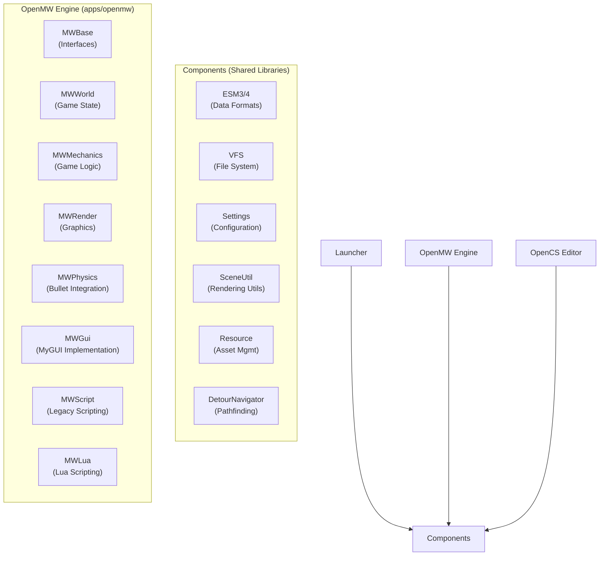

# OpenMW Codebase Structure

This document provides a comprehensive overview of the OpenMW codebase. It is designed to help new contributors understand the high-level architecture and locate specific subsystems.

## High-Level Architecture

OpenMW is built as a set of modular libraries (`components`) that power three main applications: the **Engine**, the **Editor** (OpenCS), and the **Launcher**.

## Directory Structure

### `apps/`
Contains the entry points and application-specific logic.

#### `apps/openmw/` (The Game Engine)
The engine is split into namespaces loosely corresponding to subsystems.
-   **`mwbase/`**: Defines abstract interfaces for all major systems (`Environment`, `World`, `WindowManager`). This allows for decoupling and circular dependency avoidance.
-   **`mwworld/`**: Managing the game world state.
    -   [`Ptr.hpp`](../apps/openmw/mwworld/ptr.hpp): The `MWWorld::Ptr` class is the handle to any object in the world.
    -   [`CellStore`](../apps/openmw/mwworld/cellstore.hpp): Manages objects within a cell.
    -   [`Class`](../apps/openmw/mwworld/class.hpp): Strategy pattern for object behaviors (NPCs, Doors, etc.).
    -   [`Player.cpp`](../apps/openmw/mwworld/player.cpp): Player-specific logic and state.
-   **`mwmechanics/`**: The "simulation" layer.
    -   [`Actors`](../apps/openmw/mwmechanics/actors.hpp): Updates actor position and state (bridge between physics and logic).
    -   [`CreatureStats`](../apps/openmw/mwmechanics/creaturestats.hpp): Attributes, skills, health, magic effects.
    -   [`AiSequence`](../apps/openmw/mwmechanics/aisequence.hpp): AI package manager (Combat, Wander, etc.).
    -   [`Combat`](../apps/openmw/mwmechanics/combat.cpp) & [`SpellCasting`](../apps/openmw/mwmechanics/spellcasting.cpp): Implementations of gameplay actions.
-   **`mwrender/`**: Rendering implementation using OpenSceneGraph.
    -   Handles camera, water, sky, and scene graph management.
-   **`mwphysics/`**: Wrapper around Bullet Dynamics.
    -   [`MovementSolver`](../apps/openmw/mwphysics/movementsolver.cpp): Character movement controller (Collision & sliding logic).
-   **`mwgui/`**: Implementation of the user interface (Inventory, Journal, HUD) using MyGUI.
-   **`mwscript/`**: formatting and execution of Morrowind's legacy scripting language.
-   **`mwlua/`**: The new Lua scripting interface.

#### `apps/opencs/` (The Construction Set)
A Qt-based editor for ESM/content files.
-   **`model/`**: implementation of the document-view model.
    -   `world/`: ESM record definitions (Tables, Columns).
    -   `doc/`: Document state management (Undo/Redo).
-   **`view/`**: Qt widgets for visualization.
    -   `render/`: The 3D view widget.

### `components/`
Shared functionality used by all applications.

-   **`esm3/` & `esm4/`**: Parsers and writers for the ESM (Elder Scrolls Master) file formats. Critical for reading game data.
-   **`vfs/`**: Virtual File System. Abstracts access to data directories and BSA archives.
-   **`settings/`**: Configuration manager. Loads `settings.cfg` and handles default values.
-   **`sceneutil/`**: Extensions and utilities for OpenSceneGraph.
    -   [`Optimizer`](../components/sceneutil/optimizer.hpp): Custom geometry optimization passes.
    -   [`LightManager`](../components/sceneutil/lightmanager.hpp): Management of dynamic lights.
-   **`resource/`**: Asset management system.
    -   [`SceneManager`](../components/resource/scenemanager.hpp): Loads and caches NIF files as OSG nodes.
    -   [`BulletShapeManager`](../components/resource/bulletshapemanager.hpp): Caches Bullet collision shapes.
    -   [`ImageManager`](../components/resource/imagemanager.hpp): Texture loading.
-   **`terrain/`**: Terrain rendering, paging, and LOD system.
-   **`detournavigator/`**: Integration of Recast/Detour for navigation (Pathfinding).
-   **`nif/` & `nifosg/`**: Low-level parsing of NIF files and conversion to standard OSG structures.

## Recent Architectural Shifts (2025)

1.  **Render Loop Synchronization**: `RenderingManager::update` has been refactored to ensure the main camera update happens before any uniform or state updates. This prevents a 1-frame "lag" in uniforms derived from the camera (like fog and inverse view matrices).
2.  **Stamina-First Defense**: The `CreatureStats::takeDamage` function now implements a "Stamina Shield" where melee/ranged damage is diverted to Fatigue as long as it is above zero.
3.  **Modern Shadow Pipeline**: The engine now defaults to higher-resolution cascaded shadow maps, managed via `MWShadowTechnique`.

## Essential Utilities for Contributors

-   **`MWBase::Environment::get()`**: The central singleton to access nearly all managers (World, Mechanics, Sound, GUI, Scripting).
-   **`MWWorld::Ptr`**: The universal handle for game objects. It safely wraps a reference to many different record types (NPCs, Items, Statics).
-   **`Misc::Rng`**: Centralized random number generation to ensure consistency and seed-ability.
